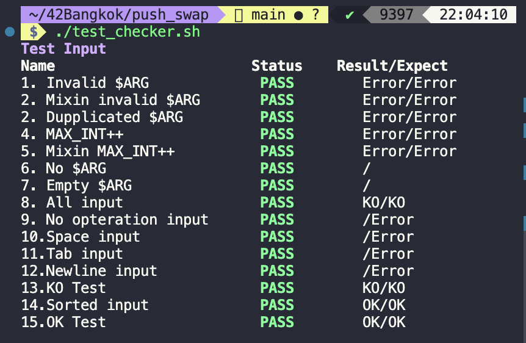

<div align="center">
  <h1>push_swap - 42 Bangkok</h1>
  <br>
  
</div>
This project will make you sort data on a stack, with a limited set of instructions, using the lowest possible number of actions.

## Table of contents
- [About](#about)
- [Test with script](#test-with-script)
- [Solution (Spoiler)](#solution)

## About
<div id="about"></div>

* The push_swap project is a very simple and highly effective algorithm project: data will need to be sorted.  
You have at your disposal a set of int values, 2 stacks and a set of instructions to manipulate both stacks.  

* The goal ?  
Write a program in C called push_swap which calculates and displays on the standard output the instructions, that sort the integers received as arguments.

* The learning objectives of this project are rigor, use of C and use of basic algorithms. Especially looking at the complexity of these basic algorithms.

* Within your mandatory part you are allowed to use the following functions:  
malloc, free, exit, write, read

## Operations

* The goal is to sort in ascending order numbers into stack a.  
* To do this you have the following operations at your disposal:

| Operations | Explanation |
| :--- | :--- |
| sa | swap a - swap the first 2 elements at the top of stack a |
| sb | swap b - swap the first 2 elements at the top of stack b |
| ss | sa and sb at the same time |
| pa | push a - take the first element at the top of b and put it at the top of a |
| pb | push b - take the first element at the top of a and put it at the top of b |
| ra | rotate a - shift up all elements of stack a by 1. The first element becomes the last one |
| rb | rotate b - shift up all elements of stack b by 1. The first element becomes the last one |
| rr | ra and rb at the same time |
| rra | reverse rotate a - shift down all elements of stack a by 1. The last element becomes the first one |
| rrb | reverse rotate b - shift down all elements of stack b by 1. The last element becomes the first one |
| rrr | rra and rrb at the same time |

## Grading

* Sorting 100 numbers:
* I achieve an average of 600 Operations
  
| Operations | Points |
| :---: | :---: |
| less than 700 | 5 |
| less than 900 | 4 |
| less than 1100 | 3 |
| less than 1300 | 2 |
| less than 1500 | 1 |

* Sorting 500 numbers: 
* I achieve an average of 5400 Operations 

| Operations | Points |
| :---: | :---: |
| less than 5500 | 5 |
| less than 7000 | 4 |
| less than 8500 | 3 |
| less than 10000 | 2 |
| less than 11500 | 1 |

## Bonus

* The Bonus exercise was to write a Program called 'checker' that can read the Operations from stdin and perform them on a stack of numbers.
* checker will return 'KO' when the given Operations will sort the numbers in ascending order. Otherwise it returns 'KO'.
* In case of an error (f.ex. Operations doesn't exist) it returns 'Error'.

## Execution

Basic test with official `checker` from intra
```bash
# Declare number arguments
ARG="10 7 8 2 3 6 1 4 9 5";
# Check sorting opertation
./push_swap $ARG | ./checker_OS $ARG

# Count sorting opertation
./push_swap $ARG | wc -l
```

Use ruby command to generate sequence number in size range
```sh
# Declare number arguments
ARG=$(ruby -e "puts (1..500).to_a.shuffle.join(' ')")

# Inpect generated numbers
echo $ARG

# Check sorting opertation
./push_swap $ARG | ./checker_OS $ARG

# Count sorting opertation
./push_swap $ARG | wc -l
```

## Test with script
<div id="test-with-script"></div>

<div align="left">
  
</div>

Test your program easier with my script. It show sorting times and status beside evalute your grade in the same time. there are 3 test script.
- `test_random.sh`: A single test with random numbers in size range.
- `test_pushswap.sh`: Full test `push_swap` program with every relevance case.
- `test_checker.sh`: Check your `checker` file in bonus part.

### Install script
Option 1: clone entire project
```bash
git clone https://github.com/viruskizz/42bangkok-push_swap.git
```

Option 2: Download from gist

- [test_random.sh](https://gist.github.com/viruskizz/5512ab5fca0b7dd9eefe157fc9680773) 
- [test_pushswap.sh](https://gist.github.com/viruskizz/61b4ff717d530280102e16ba2d579460)
- [test_checker.sh](https://gist.github.com/viruskizz/17c9adf04b73d21487a882b18fe2a55b)
  
You can use `curl` to download a file that you need in terminal
```bash
# test_random.sh
curl https://gist.github.com/viruskizz/5512ab5fca0b7dd9eefe157fc9680773 -o test_random.sh

# test_pushswap.sh
curl https://gist.github.com/viruskizz/61b4ff717d530280102e16ba2d579460 -o test_pushswap.sh

# test_checker.sh
curl https://gist.github.com/viruskizz/17c9adf04b73d21487a882b18fe2a55b -o test_checker.sh
```

### How to use

#### 1. `test_random.sh`
A single test suite for minimal test and fast. It support 2 argument with 3 solutions
- **No argument**
random number size between range 1 - 500 

```bash
$ ./test_random.sh
Size: 159
Sorted: OK
Times: 1370
Point: 5/5
Status: PASS
```

- **Single argument**
Single argument is end of number. Test will supply number 1 to end of number.
```bash
# Test number 1 - 100
$ ./test_random.sh 100
Size: 100
Sorted: OK
Times: 697
Point: 5/5
Status: PASS
```
- **Two argument**
Two argument is meant to start and end of number
```bash
# Test number -50 to 49
$ ./test_random.sh -50 49
Size: 100
Sorted: OK
Times: 692
Point: 5/5
Status: PASS
```

#### 2. `test_pushswap.sh`
This is a fully test `push_swap` program. It run all relevance case.
```bash
./test_pushswap.sh
```

#### 3. `test_checker.sh`
This is fully test `checker` file. It run all relevance case.
```bash
./test_checker.sh
```

#### Script Editing
Customize a script for your desire test.
- Chage file location if file is not in same root project directory
```bash
## Setup
FILE="checker"
```

- Change `test_pushswap.sh` argument at bottom of file
```bash
### Bottom of test_push
START=1
END=500
ROUND=20
test_size $START $END $ROUND
```

#### Status Description
| Status | Description |
| :--- | :--- |
| PASS | The result is matched with expectation `OK` or `KO` or `Error` |
| FAIL | The result is not matched with expectation |
| STDERR | The expect `Error` need output _standard error_.|

-----

<details id="solution">
  <summary>
    <big><strong>Solution</strong></big>
    <small style="color: red"> Spoiler Alert!!</small>
  </summary>

  ## Approach for Algorithm

  You can design your own fastest algorithm. I use 3 Algorithm for diference numbers size

  ### 0. Hidden Sort
  Create a sorted array with any algorythm. Sorted array that number is sorted smaller to bigger. The index of number is times of greater than other number. for example `[1, 2, 3]` `1` is great than other numbers in array 0 times so `1` is index `0`. This is a utility for your sorting operation.
  - To get a sorted index of number
  - Find sorted median

  ### 1. Last 3 numbers Sort
  - There are only 5 solution for 3 numbers.
  - Try yourself with sampling numbers and write sorting operation.
  - Hard code to sort this size

  ### 2. Partition Sort
  This solution is best for size of numbers less than 200 

  ### 3. Quick Sort
  This solution is best for size of numbers greater than 200

</details>


----

## Credit
- **Friend**:
  - _sharnvon_
  - _cchettana_
  - _cananwat_
- [README Insparation](https://github.com/42akurz/42_push_swap)
- [Partialsort Concept](https://medium.com/@jamierobertdawson/push-swap-the-least-amount-of-moves-with-two-stacks-d1e76a71789a)
- [Quicksort Concept](https://github.com/anaiel/push_swap)
<!--
1. I go through stack A looking for a sequenece of numbers that is already in ascending order.
2. I keep this sequenece of numbers in stack A and push all other elements to stack B.
3. Before performing any further Operations, i calculate for every single element in Stack B how many operations it would need to get to it's correct position in stack A.
4. I choose the element on stack B, that needs the fewest amount of Operations. Then I perform the Operations that are required to get it to the correct position in stack A.
5. I repeat step 3 and step 4 until stack A is sorted and stack B is empty.
6. Now i only need to align stack A, which means rotating it until the smallest element is at the top.
-->